# KØS SEJL ⛵

**A sailing game for the young sailors of KØS Sejlsport on Svaneknoppen, Copenhagen.**

### ▶ [Play it in your browser: athraen.github.io/KOSGame](https://athraen.github.io/KOSGame/)

Works on phone, tablet and desktop. Install it as an app from the browser menu and it also works offline.

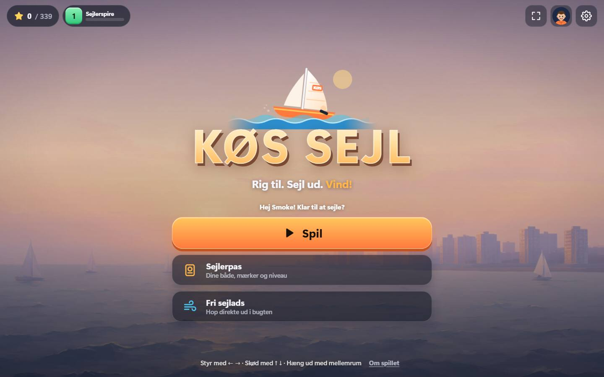

In winter there isn't much sailing on Svanemøllebugten. KØS SEJL lets club members aged 8 to 26 (and their parents and
coaches) keep practising at home: racing, right of way, navigation, docking, RIB driving, rigging and knots. The
whole game takes place in our own waters: Svanemøllebugten, the club pier on Svaneknoppen, the channel past
Svanemøllehavnen and the race area out on Øresund.

The game is in **Danish** by default, with **English** under settings.

> **Status:** all eight places are playable (about 110 activities). The game keeps being polished with feedback from the club's sailors and trainers.

## The harbour map

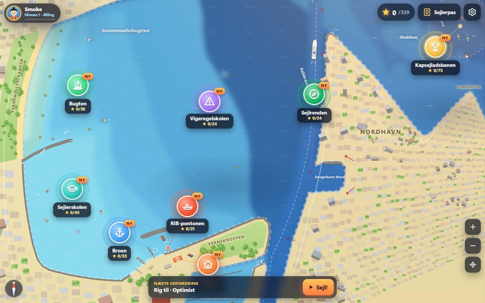

Everything starts from an illustrated map of the area. Each place is a part of the game. On a small screen not every place fits, so the list button (**Alle steder**) next to the zoom buttons opens all places at once, and a first-time sailor is pointed to the sailing school with a pulsing **Start her** label:

| Place | What you do there |
|---|---|
| **Sejlerskolen** (sailing school) | Coached lessons with coach Ida: steering and stopping, points of sail, tacking, gybing, getting out of irons, trimming, hiking in gusts, man overboard |
| **Bugten** (the bay) | Free sailing in any unlocked boat, collect rings, clean up floating rubbish, time trials |
| **Kapsejladsbanen** (race course) | Races with a real 5-4-1-0 start (flags and horns), computer opponents, mark roundings, penalty turns and a championship for each boat class |
| **Vigeregelskolen** (right-of-way school) | "Who must give way?" situations that you then sail out yourself: the racing rules (port/starboard, windward/leeward, overtaking, tacking, mark-room) and the ordinary collision rules for motorboats, ferries and ships |
| **Sejlrenden** (the channel) | Buoyage (red and green channel marks, cardinal marks), following the channel, yellow swim-zone buoys, night sailing by lights, compass courses |
| **Broen** (the pier) | Docking and undocking under sail and with the RIB |
| **RIB-pontonen** (RIB pontoon) | Drive the club's orange RIB: tow a line of Optimists, rescue a capsized dinghy, lay race marks, collect gear that has drifted off |
| **Klubhuset** (clubhouse) | Rig and unrig every boat class, tie knots, capsize recovery, sailing quiz |

## Screenshots

<table>
<tr>
<td>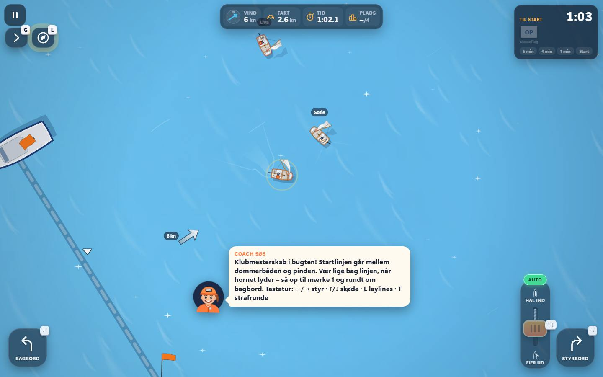<br><sub>Optimist club championship: computer opponents, start countdown with flags</sub></td>
<td>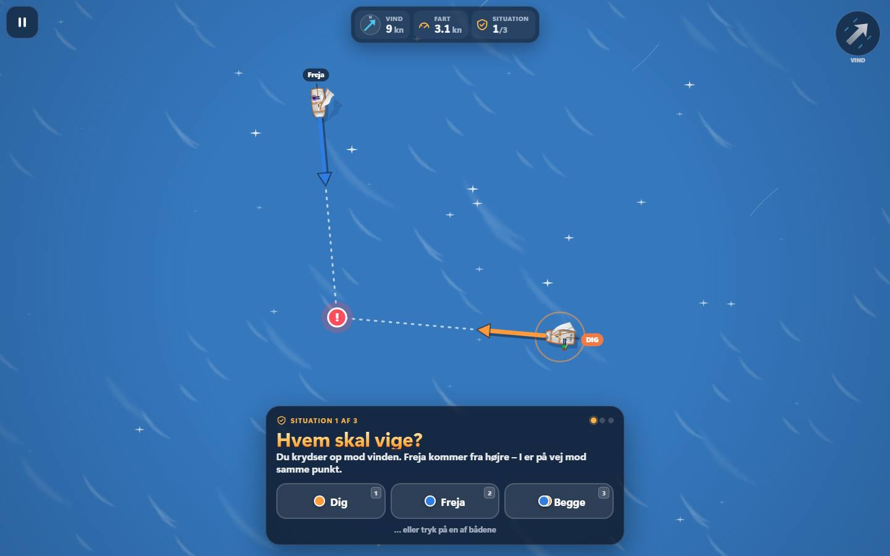<br><sub>Right-of-way school: who must give way?</sub></td>
</tr>
<tr>
<td>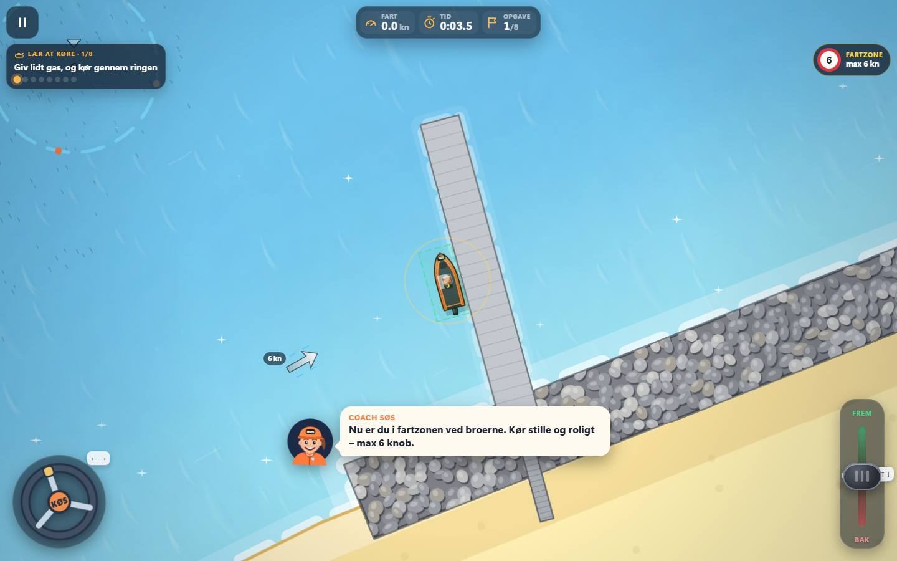<br><sub>Driving the club RIB: throttle lever, wheel, speed limit zone</sub></td>
<td>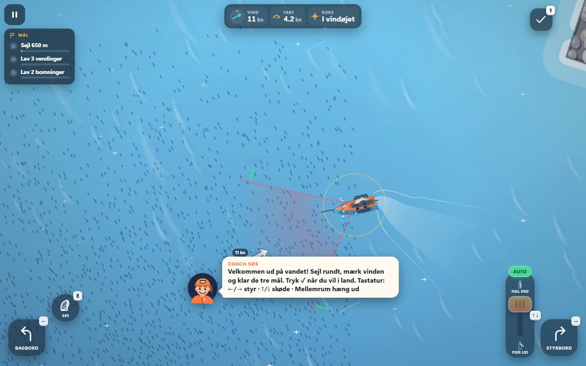<br><sub>Free sailing in a 29er: gusts on the water, no-go zone, gennaker</sub></td>
</tr>
<tr>
<td>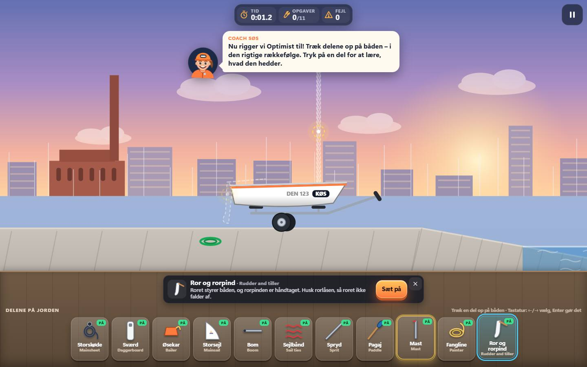<br><sub>Clubhouse: rig an Optimist, part by part</sub></td>
<td>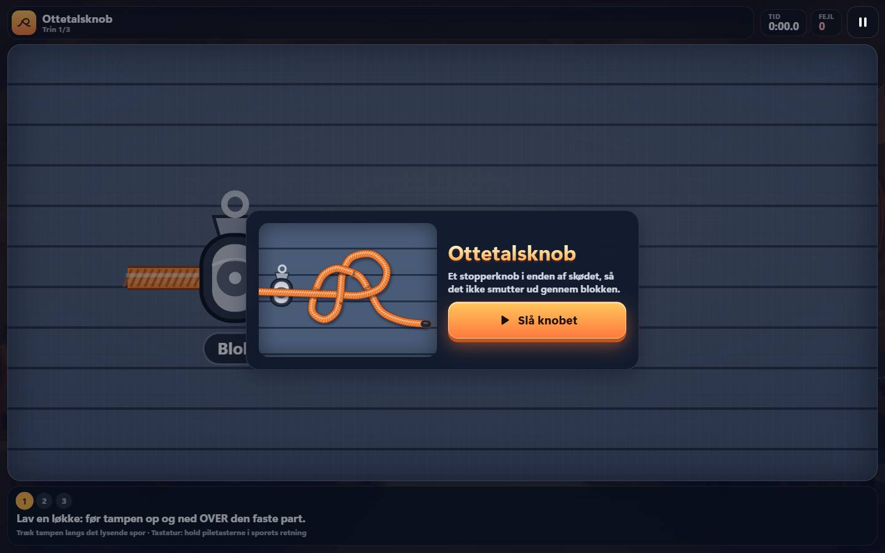<br><sub>Clubhouse: tie a figure-eight knot (ottetalsknob)</sub></td>
</tr>
</table>

On a phone:

<p>
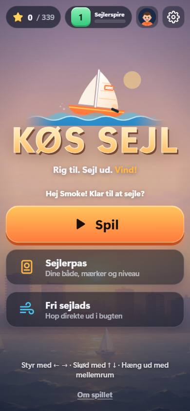
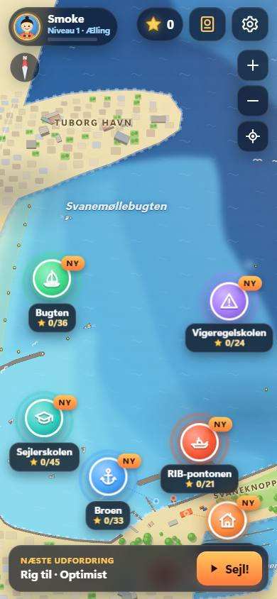
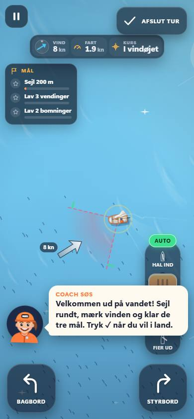
</p>

### What makes it tick

- **Real sailing physics.** True and apparent wind, gusts and shifts, heel and hiking, sail trim and stall, luffing, irons, tacks and gybes, planing, capsizing. Sail power flattens in a strong breeze the way a crew would depower the rig, so more wind means more speed (and more risk), not less.
- **Real racing rules.** Port/starboard, windward/leeward, overtaking, tacking and mark-room are judged by the same code that drives the computer opponents. A rule 44 penalty is one turn (a 360°).
- **The real KØS coaches** (Jesper, Ida, Storm, Marius, Maria, Anton) explain things in short, kid-friendly Danish sentences, with English one tap away. Every lesson and race opens with a card that says in a line or two what to do.
- **Made for thumbs.** Large touch targets, steering pads, a sheet slider, HUD that fits a phone in portrait and landscape, and keyboard control on desktop.
- **Accessible.** Pinch-zoom works on menus, dialogs trap and restore keyboard focus, screens announce themselves to screen readers, and reduced-motion is respected.

## The boats

You earn stars and unlock the club's boats in the same order the club's sailors move up:
**Optimist → Tera → Feva → Zest → ILCA → 29er → H-boat → J70**, plus the club's orange **RIB**.
Each boat handles differently. The Optimist is slow and forgiving. The ILCA needs real hiking. The 29er planes and
capsizes easily. The H-boat is heavy and steady. The J70 planes downwind with its gennaker.

Three help levels make it fun for an 8-year-old as well as a 29er sailor:

- **Let** (easy): automatic sail trim, no capsizing.
- **Normal**
- **Pro**: manual trim, capsizing and penalty turns.

Parents and coaches can unlock everything in the settings.

## Controls

| | Keyboard | Touch |
|---|---|---|
| Steer | ← → or A D | Bagbord / Styrbord buttons |
| Sheet in / out (pull the sail in / let it out) | ↑ ↓ or W S | Sheet slider (or AUTO) |
| Hike out | Hold Space | HIKE button |
| Gennaker / spinnaker | E | SPI button |
| RIB throttle | ↑ ↓ | Throttle lever and wheel |
| Pause | Esc or P | Pause button |

## Install and offline play (PWA)

Open the game over https (the GitHub Pages link above) or `http://localhost` and use the browser's *Install app* /
*Add to home screen*. The service worker (`sw.js`) stores every game file on the first visit, so the game then works
without a network. When a new version is published a *Ny version klar!* toast offers an update; it never interrupts a
run in progress and waits until you are back on a menu. Progress, stars and settings are kept in the browser's
`localStorage`; if the browser blocks it the game still works but tells you that progress will not be saved.

After changing or adding game files, refresh the offline file list (`node tools/gen-precache.js`) so players get the
new version.

## Anonymous usage statistics

So the club can see whether the game is used, it reports anonymous usage to the club's own Matomo server: which screens are opened, which activities
are started and finished (with stars and time), which boat, language and control/assist/sound settings are used, and whether the app was installed.
Each screen is counted as its own page (`/kort`, `/sejlerskolen`, `/sejlerskolen/school.steer`, ...). No cookies are ever set.
Each device gets a random player id (e.g. `P-7K3QX9`, used as the Matomo User ID) so progress can be followed over time, sent with the
player's age band, chosen boat, activities completed, stars and level.
It is cookieless, respects the browser's Do-Not-Track setting, and never sends the player's name or anything personal. It is switched off on localhost,
in headless/test runs and in God mode, and the game works the same if an adblocker blocks it. Code: `js/ui/track.js`.

## Running it locally

There is no build step: the repository is the game.

- Double-click `index.html`.
- Or serve it locally (needed for installing as an app and offline play):

```sh
node tools/serve.js        # then open http://localhost:8080
```

## Testing

**God mode** (for testing by hand): open the game with `#god=1` at the end of the address, e.g.
`https://athraen.github.io/KOSGame/#god=1`. Everything unlocks, a gold **GOD** badge shows on the title screen,
and the pause menu gets **1★ / 2★ / 3★** buttons that finish the current activity instantly. `#god=0` turns it off.
It is stored in this browser only (`localStorage` key `kos.godmode`). Stars won this way are kept;
use *Nulstil fremskridt* in settings to start over.

All browser tests run in a hidden browser (headless Chrome via Playwright: `npm install` once).

```sh
node tools/run-tests.js            # core simulation tests + offline file list check (fast)
node tools/run-tests.js all        # + translation check and a click-through of every screen and activity
node tools/test-core.js            # physics, wind, rules and computer-sailor tests (Node only)
node tools/smoke.js                # every screen and activity, phone/tablet/desktop screenshots
node tools/check-i18n.js           # missing Danish/English text
node tools/gen-precache.js         # refresh the offline file list after changing game files
```

## Project structure

```
index.html            all screens; loads the scripts in dependency order (no bundler)
sw.js, manifest.webmanifest   offline cache and install metadata (sw.js precache list is generated)
css/                  style.css (menus), hub.css (map), game.css + controls.css (play screen), modes/*.css
js/core/              boats, wind, physics, rules, AI helm, world (venues), activities  (pure, runs in Node too)
js/render/            sprites (boats, buoys, avatars), water, scene (camera, canvas), effects
js/ui/                app (screens, loop, results, PWA), hub (harbour map), ui (HUD, coach, dialogs), input, audio, storage
js/modes/             one file per game mode: school, sail, race, rowschool, nav, dock, rib, rigging, knots, capsize, quiz
assets/               icons, painted backgrounds
docs/                 ARCHITECTURE.md, MODE-AUTHORING.md, screenshots, reference charts
tools/                dev server, headless test and screenshot tools
SPEC.md               the contract between the modules
```

## How it's built

Plain HTML, CSS and JavaScript with no frameworks or build tools. All scripts attach to a single global object, `KOS`.

- **Simulation** (`js/core/`): wind with moving gusts and shifts, sailing physics per boat class, the racing rules
  and collision rules, and computer-controlled sailors. It is pure and deterministic, so it also runs in Node for
  the tests.
- **Graphics**: SVG boats, buoys and characters drawn on a canvas. The painted backgrounds in `assets/bg/` were
  generated locally with ComfyUI.
- **Sound**: synthesised live with the Web Audio API, so there are no audio files.
- **App**: installable and playable offline. A service worker stores every game file on the first visit.

[`SPEC.md`](SPEC.md) is the design contract between the modules. The hosted version on GitHub Pages is updated when a
version tag (`v*`) is pushed (see [`.github/workflows/pages.yml`](.github/workflows/pages.yml)).

## Credits

Made by Allan Thraen for KØS Sejlsport, with Claude Code.

- **Painted backgrounds** (the title and menu art in `assets/bg/`) were generated locally with
  [ComfyUI](https://github.com/comfyanonymous/ComfyUI) (Qwen-Image 2.1 text-to-image, no photos or logos), then
  downscaled to JPEG (details in `assets/bg/credits.txt`). All boats, buoys, characters, icons and
  the harbour map are drawn in code (SVG and canvas), and all sound is synthesised, so there are no third-party
  images or audio files in the game.
- The nautical charts used as references for the game's map are only in `docs/reference/` and are not part of the game.
- Thanks to the sailors and trainers of KØS Sejlsport for ideas and play-testing.
